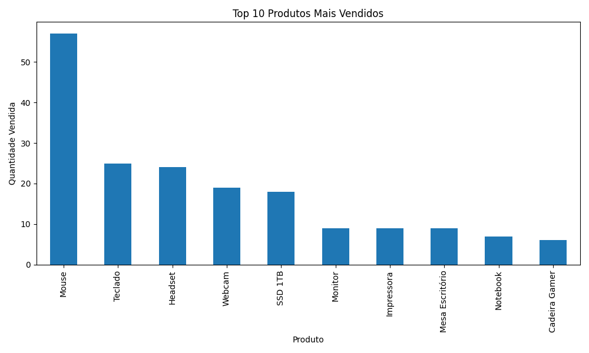
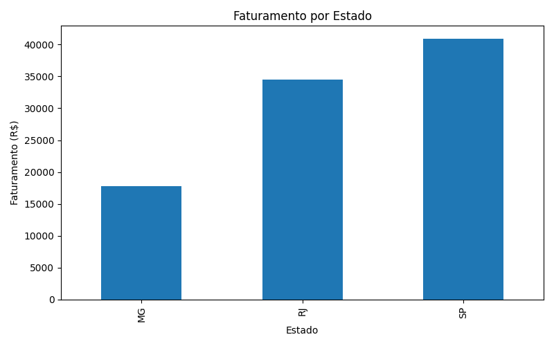
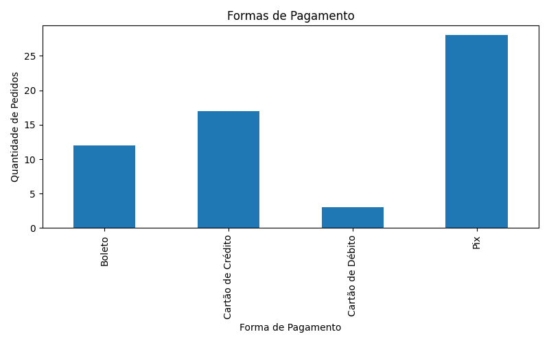

📊 Dashboard de Vendas

Projeto desenvolvido em Python para análise de vendas e geração de indicadores de negócio utilizando Pandas e Matplotlib.

🚀 Objetivo
Este projeto foi desenvolvido com o objetivo de praticar análise de dados, manipulação de arquivos CSV e geração de dashboards simples para apoio à tomada de decisão.

🛠️ Tecnologias Utilizadas
Python
Pandas
Matplotlib
CSV

📈 Indicadores Gerados
Faturamento Total
Produto Mais Vendido
Canal Mais Lucrativo
Forma de Pagamento Mais Utilizada
Estado com Maior Faturamento
Melhor Vendedor
Ticket Médio

📊 Gráficos Gerados

## Top 10 Produtos Mais Vendidos

## Faturamento por Estado

## Formas de Pagamento

▶️ Como Executar

Instale as dependências:
pip install pandas matplotlib
Execute o projeto:

python dashboard.py
👨‍💻 Autor

Nathan Ferreira
Estudante de Ciência de Dados e estagiário na CSN – Companhia Siderúrgica Nacional, atuando na área de Inteligência de Suprimentos com automação de processos (RPA), SAP e análise de dados.